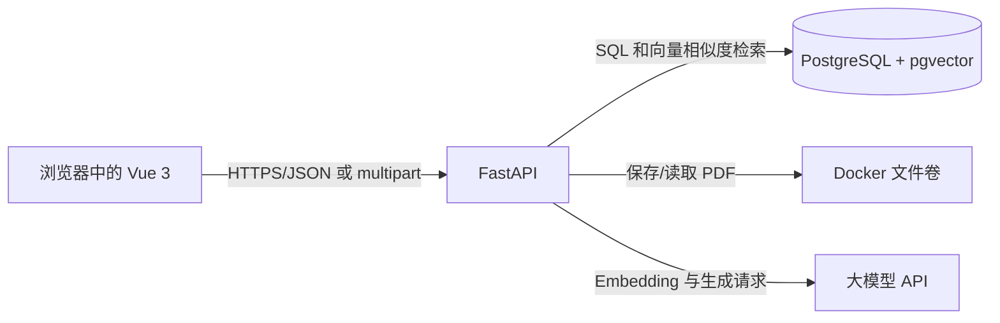

# Career Knowledge Copilot - 技术设计

本设计面向零基础开发者，说明各组件为什么存在、它们如何交换数据。它是 MVP 的实现蓝图，不是业务代码。

## 1. 技术栈与职责

| 组件 | 技术 | 作用 |
| --- | --- | --- |
| 前端 | Vue 3 | 展示文档和对话页面，收集用户文件与问题，调用后端 API。 |
| 后端 | Python + FastAPI | 校验请求、保存数据、解析 PDF、检索片段、调用大模型并返回统一结果。 |
| 数据库 | PostgreSQL | 保存文档元数据、对话和消息等结构化数据。 |
| 向量检索 | pgvector | PostgreSQL 扩展，用数字向量寻找语义最接近的文本片段。 |
| 文件存储 | Docker 命名卷 | MVP 保存原始 PDF；生产环境可换为对象存储。 |
| 容器编排 | Docker Compose | 用一个命令启动前端、后端和数据库，减少环境配置差异。 |
| 大模型服务 | 兼容 Chat/Embedding API 的模型 | 分别把文本转为向量（Embedding）和依据资料生成回答（Chat）。 |

## 2. 总体架构



前端不直接连接数据库，也不直接调用大模型。这样 API 密钥只保存在后端环境变量中，数据库结构也不会暴露给浏览器。

## 3. 上传到可检索的数据流

1. Vue 使用 `multipart/form-data` 将 PDF 发送到 `POST /api/documents`。
2. FastAPI 校验扩展名、文件大小和 PDF 文件头，生成 `document` 记录，初始状态为 `processing`，并把原文件写入 Docker 卷。
3. 后端任务读取每一页的可提取文本。MVP 不使用 OCR，所以无文字的扫描 PDF 应设为 `failed`。
4. 后端按页把文本切成约 500 至 800 个字符、带少量重叠的小段（chunk）。保留每段的 `page_number`。
5. 后端请求 Embedding API，把每段文字转换为固定长度的数字数组，写入 `document_chunks.embedding`。
6. 全部步骤完成后将文档状态更新为 `ready`；任何一步失败则更新为 `failed` 并记录错误原因。

## 4. 提问到带引用回答的数据流

1. 前端调用消息接口，提交问题和 `conversation_id`。
2. FastAPI 将问题写入 `messages` 表，角色为 `user`。
3. 后端调用 Embedding API 得到问题向量。
4. pgvector 使用余弦距离在 `document_chunks` 中找最相关的前 5 段，并关联筛选状态为 `ready` 的文档。
5. 若没有达到阈值的片段，后端保存固定的“没有足够依据”回答，不调用生成模型。
6. 否则后端把问题和片段文本（包含文件名、页码）传给 Chat API，并在提示词中要求仅依据给定资料回答、不能编造。
7. 后端保存助手回答，并在 `message_citations` 中保存每个引用的片段 ID、文件名快照和页码快照。
8. API 将正文和引用返回 Vue；前端不自行生成页码或引用。

## 5. 最小数据库设计

所有时间使用 UTC。`uuid` 是随机且不易猜测的记录 ID；`jsonb` 可以保存少量结构化引用而无需频繁改表；`vector` 是 pgvector 提供的向量类型。向量维度 `1536` 必须与实际选用的 Embedding 模型一致。

```sql
CREATE EXTENSION IF NOT EXISTS vector;

CREATE TABLE documents (
  id uuid PRIMARY KEY,
  filename varchar(255) NOT NULL,
  storage_path text NOT NULL,
  file_size_bytes integer NOT NULL CHECK (file_size_bytes > 0),
  status varchar(20) NOT NULL CHECK (status IN ('processing', 'ready', 'failed')),
  error_message text,
  created_at timestamptz NOT NULL DEFAULT now(),
  deleted_at timestamptz
);

CREATE TABLE document_chunks (
  id uuid PRIMARY KEY,
  document_id uuid NOT NULL REFERENCES documents(id) ON DELETE CASCADE,
  page_number integer NOT NULL CHECK (page_number > 0),
  chunk_index integer NOT NULL,
  content text NOT NULL,
  embedding vector(1536) NOT NULL,
  UNIQUE (document_id, chunk_index)
);

CREATE INDEX document_chunks_embedding_idx
  ON document_chunks USING hnsw (embedding vector_cosine_ops);

CREATE TABLE conversations (
  id uuid PRIMARY KEY,
  browser_token uuid NOT NULL,
  created_at timestamptz NOT NULL DEFAULT now(),
  updated_at timestamptz NOT NULL DEFAULT now()
);

CREATE TABLE messages (
  id uuid PRIMARY KEY,
  conversation_id uuid NOT NULL REFERENCES conversations(id) ON DELETE CASCADE,
  role varchar(10) NOT NULL CHECK (role IN ('user', 'assistant')),
  content text NOT NULL,
  created_at timestamptz NOT NULL DEFAULT now()
);

CREATE TABLE message_citations (
  id uuid PRIMARY KEY,
  message_id uuid NOT NULL REFERENCES messages(id) ON DELETE CASCADE,
  chunk_id uuid REFERENCES document_chunks(id) ON DELETE SET NULL,
  filename_snapshot varchar(255) NOT NULL,
  page_number integer NOT NULL CHECK (page_number > 0)
);
```

表的关系：一个 `documents` 有多个 `document_chunks`；一个 `conversations` 有多条 `messages`；一条助手 `messages` 可以有多条 `message_citations`。删除文档时片段级联删除；引用保留文件名和页码快照，历史消息仍能说明曾引用何处。

## 6. 最小 API 约定

| 方法和路径 | 请求 | 返回 | 用途 |
| --- | --- | --- | --- |
| `POST /api/documents` | PDF 文件 | 文档 ID、状态 | 上传并触发处理 |
| `GET /api/documents` | 无 | 文档列表 | 渲染管理页 |
| `DELETE /api/documents/{id}` | 无 | 204 | 删除文档及其片段 |
| `GET /api/documents/{id}` | 无 | 单个文档状态 | 轮询处理状态 |
| `POST /api/conversations` | 浏览器令牌 | 对话 ID | 创建当前浏览器的基础对话 |
| `GET /api/conversations/{id}/messages` | 无 | 消息和引用 | 刷新后恢复历史 |
| `POST /api/conversations/{id}/messages` | `{"content":"问题"}` | 助手消息和引用 | 提问并生成回答 |

所有失败响应采用 JSON：`{"detail":"用户可理解的错误说明"}`。前端根据 HTTP 状态码展示提示：`400` 是输入不合法，`404` 是资源不存在，`409` 是状态冲突，`500` 是服务器或模型暂时失败。

## 7. Docker Compose 的最小职责

- `frontend`：构建 Vue 3 静态页面并提供浏览器访问入口。
- `backend`：运行 FastAPI，读取 `DATABASE_URL`、`LLM_API_KEY`、`LLM_BASE_URL` 等环境变量。
- `db`：运行带 pgvector 扩展的 PostgreSQL，并挂载数据库持久化卷。
- `pdf_storage`：挂载给后端，避免容器重启后原 PDF 丢失。

密钥仅放在本机 `.env` 文件或部署平台的环境变量中，`.env` 不提交到 Git。Docker Compose 文件中只引用变量，不写入真实密钥。

## 8. 实现约束与失败处理

- 由于没有登录和复杂权限，`browser_token` 仅用于在同一浏览器中找回当前对话，不应被当作安全身份认证。
- 每次模型调用应设置超时和错误捕获；错误信息不能暴露 API 密钥或内部堆栈。
- 文档删除必须同时删除文件卷中的原文件和数据库中的片段，避免回答引用已删除资料。
- PDF 解析和 Embedding 可能耗时，应使用后台任务，接口快速返回 `processing` 状态。
