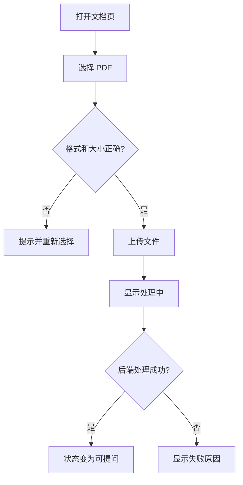
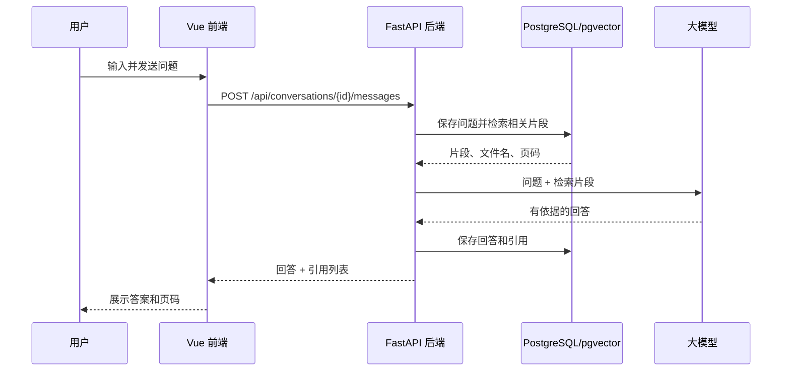

# Career Knowledge Copilot - 用户操作流程

本文件描述用户从第一次进入产品到核对答案、删除资料的完整操作。它是前端页面、后端接口和测试用例共同遵循的行为说明。

## 1. 首次进入与上传资料

1. 用户打开应用，默认进入“文档”页。
2. 页面请求文档列表；列表为空时显示空状态和上传入口。
3. 用户点击“上传 PDF”，在本机选择一个不超过 20 MB 的 `.pdf` 文件。
4. 前端先检查文件扩展名和大小。校验失败时直接提示原因，不发送请求。
5. 前端把文件发送给后端，并在列表中显示上传中状态。
6. 后端保存原文件，创建文档记录，异步提取 PDF 文字、按页切分、生成向量并写入数据库。
7. 前端轮询文档状态：成功后显示“可提问”；失败后显示“处理失败”和原因。

## 2. 查看与删除文档

1. 用户在文档页查看文件名、大小、上传时间和状态。
2. 用户点击某一行的删除图标。
3. 页面显示确认框，明确说明删除后该文件不会再参与问答。
4. 用户取消时，不调用删除接口，列表不变。
5. 用户确认时，前端调用删除接口并临时禁用该行操作。
6. 后端删除原文件、文档片段与向量索引；成功后前端从列表移除该行。
7. 若删除失败，前端恢复操作按钮并显示可理解的错误提示。

## 3. 提问、回答与核对引用

1. 用户切换到“问答”页；前端读取当前浏览器保存的 `conversation_id`。
2. 若没有该 ID，前端创建一条空对话并保存返回的 ID；若有 ID，则加载该对话历史。
3. 用户输入问题，例如“这个后端实习岗位要求哪些技能？”，点击发送。
4. 前端禁止重复发送，将问题立即显示在消息列表中。
5. 后端保存用户消息，从状态为“可提问”的文档片段中检索相关内容，再把问题和片段交给大模型。
6. 后端保存助手回答和引用，返回回答正文、消息 ID 与引用列表。
7. 前端显示回答和每条 `文件名，第 N 页` 引用。
8. 用户根据文件名和页码回到原 PDF 核对原文。

## 4. 无答案和服务异常

- **资料不够**：检索结果低于相似度阈值时，系统明确提示未找到足够依据，不调用大模型或要求其猜测。
- **模型失败**：保存用户问题，显示失败提示和“重试”入口；重试会创建一条新的助手消息。
- **处理中提问**：文档尚未就绪时不参与检索；若没有其他可用文档，提示先等待处理完成。
- **文件已删除**：旧对话保留原回答文字；引用位置显示“原文件已删除”，不可假装仍可打开。

## 5. 页面状态清单

| 场景 | 页面反馈 | 用户下一步 |
| --- | --- | --- |
| 空文档库 | 空状态与上传按钮 | 上传 PDF |
| 文件上传中 | 处理中标识 | 等待状态更新 |
| 文件处理失败 | 原因与删除入口 | 重新准备文件或删除 |
| 正在生成回答 | 输入框发送按钮禁用、加载提示 | 等待或稍后重试 |
| 没有依据 | 无答案提示，不显示虚假引用 | 换一种问法或上传资料 |
